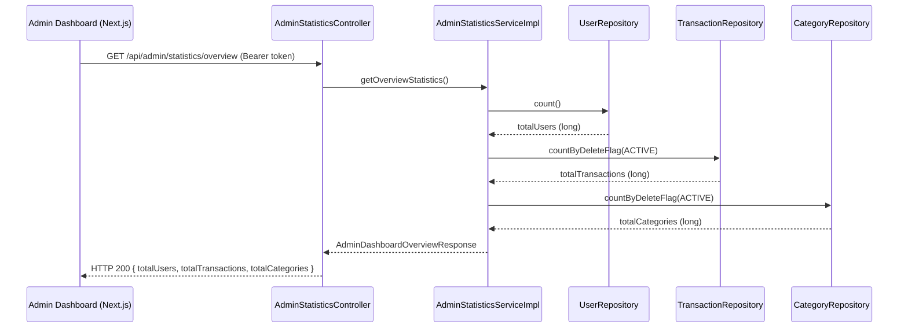

# Design Document – Admin Dashboard Statistics API

## Overview

Tính năng này bổ sung endpoint `GET /api/admin/statistics/overview` vào backend Spring Boot, trả về ba chỉ số tổng hợp toàn hệ thống: tổng số người dùng, tổng số giao dịch đang active, và tổng số danh mục đang active. Phía frontend Next.js/React sẽ gọi endpoint này để thay thế các giá trị hardcode hiện tại trên trang `app/admin/dashboard/page.tsx`.

Codebase đã có sẵn `AdminStatisticsController`, `AdminStatisticsService`, và `AdminStatisticsServiceImpl` phục vụ endpoint `/monthly-transactions`. Tính năng mới sẽ mở rộng các lớp này theo đúng pattern đã có, không tạo thêm controller hay service mới.

---

## Architecture



Luồng bảo mật:
- `JwtAuthFilter` xác thực JWT trước khi request đến controller.
- `@PreAuthorize("hasRole('ADMIN')")` trên method handler đảm bảo chỉ ADMIN mới được gọi.
- Unauthenticated → 401 (do `JwtAuthFilter`), non-admin → 403 (do Spring Security method security).

---

## Components and Interfaces

### Backend

#### 1. `AdminDashboardOverviewResponse` (DTO mới)

File: `MoneyTrack_BE/src/main/java/com/money/moneytrack_be/dto/response/AdminDashboardOverviewResponse.java`

```java
@Getter
@Builder
@AllArgsConstructor
public class AdminDashboardOverviewResponse {
    private long totalUsers;
    private long totalTransactions;
    private long totalCategories;
}
```

Sử dụng `long` (primitive) để nhất quán với `MonthlyTransactionCountResponse.count` đã có.

#### 2. `AdminStatisticsService` (mở rộng interface)

Thêm method mới vào interface hiện có:

```java
AdminDashboardOverviewResponse getOverviewStatistics();
```

#### 3. `AdminStatisticsServiceImpl` (mở rộng implementation)

Inject thêm `UserRepository` và `CategoryRepository`. Implement method:

```java
@Override
public AdminDashboardOverviewResponse getOverviewStatistics() {
    long totalUsers = userRepository.count();
    long totalTransactions = transactionRepository.countByDeleteFlag(DeleteFlag.ACTIVE);
    long totalCategories = categoryRepository.countByDeleteFlag(DeleteFlag.ACTIVE);
    return AdminDashboardOverviewResponse.builder()
            .totalUsers(totalUsers)
            .totalTransactions(totalTransactions)
            .totalCategories(totalCategories)
            .build();
}
```

#### 4. `AdminStatisticsController` (thêm endpoint)

Thêm handler mới vào controller hiện có:

```java
@GetMapping("/overview")
@PreAuthorize("hasRole('ADMIN')")
public ResponseEntity<AdminDashboardOverviewResponse> getOverview() {
    return ResponseEntity.ok(adminStatisticsService.getOverviewStatistics());
}
```

#### 5. Repository – query methods mới

**`TransactionRepository`** – thêm:
```java
long countByDeleteFlag(DeleteFlag deleteFlag);
```

**`CategoryRepository`** – thêm:
```java
long countByDeleteFlag(DeleteFlag deleteFlag);
```

Cả hai đều là Spring Data JPA derived query, không cần viết JPQL thủ công.

`UserRepository.count()` đã có sẵn từ `JpaRepository<User, Long>`.

### Frontend

#### 1. `AdminDashboardOverview` (TypeScript interface mới)

Thêm vào `MoneyTrack_FE/lib/types/api.ts`:

```typescript
export interface AdminDashboardOverview {
  totalUsers: number;
  totalTransactions: number;
  totalCategories: number;
}
```

#### 2. `statisticsApi.getOverview()` (hàm API mới)

Thêm vào `MoneyTrack_FE/lib/api/statistics.ts`:

```typescript
getOverview: () =>
  apiClient
    .get<AdminDashboardOverview>('/api/admin/statistics/overview')
    .then((r) => r.data),
```

#### 3. `AdminDashboard` page (refactor)

File: `MoneyTrack_FE/app/admin/dashboard/page.tsx`

Thay thế toàn bộ logic hardcode bằng state + `useEffect`:

```typescript
const [overview, setOverview] = useState<AdminDashboardOverview | null>(null);
const [overviewLoading, setOverviewLoading] = useState(true);
const [overviewError, setOverviewError] = useState<string | null>(null);

useEffect(() => {
  let cancelled = false;
  setOverviewLoading(true);
  statisticsApi.getOverview()
    .then((data) => { if (!cancelled) setOverview(data); })
    .catch(() => { if (!cancelled) setOverviewError('Không thể tải dữ liệu thống kê'); })
    .finally(() => { if (!cancelled) setOverviewLoading(false); });
  return () => { cancelled = true; };
}, []);
```

Xóa các import và lời gọi: `getAllUsers`, `getCategories`, `getTransactionsByMonth` từ `mock-data`.

---

## Data Models

### Response JSON

```json
{
  "totalUsers": 42,
  "totalTransactions": 1350,
  "totalCategories": 18
}
```

### Mapping giữa backend và frontend

| Backend field (`long`) | JSON key | Frontend field (`number`) |
|---|---|---|
| `totalUsers` | `totalUsers` | `totalUsers` |
| `totalTransactions` | `totalTransactions` | `totalTransactions` |
| `totalCategories` | `totalCategories` | `totalCategories` |

Jackson serialize `long` thành JSON number mà không cần cấu hình thêm. TypeScript `number` nhận JSON number trực tiếp.

### Entities liên quan

- **`User`** – bảng `users`, không có `deleteFlag` → đếm tất cả bằng `count()`.
- **`Transaction`** – bảng `transactions`, có `deleteFlag` (ordinal: 0=ACTIVE, 1=DELETED).
- **`Category`** – bảng `categories`, có `deleteFlag` (ordinal: 0=ACTIVE, 1=DELETED).

---

## Correctness Properties

*A property is a characteristic or behavior that should hold true across all valid executions of a system — essentially, a formal statement about what the system should do. Properties serve as the bridge between human-readable specifications and machine-verifiable correctness guarantees.*

### Property 1: Đếm người dùng không phân biệt vai trò

*For any* tập hợp người dùng trong hệ thống với bất kỳ phân bổ vai trò nào (USER, ADMIN, hoặc hỗn hợp), `getOverviewStatistics().totalUsers` phải bằng tổng số người dùng đã đăng ký trong hệ thống.

**Validates: Requirements 1.2**

### Property 2: Đếm giao dịch chỉ tính bản ghi ACTIVE

*For any* tập hợp giao dịch với bất kỳ tỷ lệ `deleteFlag = ACTIVE` và `deleteFlag = DELETED` nào, `getOverviewStatistics().totalTransactions` phải bằng đúng số lượng giao dịch có `deleteFlag = ACTIVE`.

**Validates: Requirements 1.3**

### Property 3: Đếm danh mục chỉ tính bản ghi ACTIVE

*For any* tập hợp danh mục với bất kỳ tỷ lệ `deleteFlag = ACTIVE` và `deleteFlag = DELETED` nào, `getOverviewStatistics().totalCategories` phải bằng đúng số lượng danh mục có `deleteFlag = ACTIVE`.

**Validates: Requirements 1.4**

### Property 4: Serialization round-trip của AdminDashboardOverviewResponse

*For any* `AdminDashboardOverviewResponse` với các giá trị `totalUsers`, `totalTransactions`, `totalCategories` tùy ý (long), khi serialize sang JSON thì object JSON phải chứa đúng ba key `totalUsers`, `totalTransactions`, `totalCategories` với giá trị tương ứng.

**Validates: Requirements 2.4**

### Property 5: Hiển thị đúng giá trị trả về từ API

*For any* `AdminDashboardOverview` response với các giá trị `totalUsers`, `totalTransactions`, `totalCategories` tùy ý, component `AdminDashboard` sau khi render thành công phải hiển thị đúng ba giá trị đó trong các stat card tương ứng.

**Validates: Requirements 3.3**

### Property 6: Deserialization JSON sang AdminDashboardOverview

*For any* JSON object chứa các trường `totalUsers`, `totalTransactions`, `totalCategories` với giá trị số tùy ý, khi deserialize thành `AdminDashboardOverview` thì các field của object kết quả phải bằng đúng các giá trị trong JSON.

**Validates: Requirements 4.2**

---

## Error Handling

### Backend

| Tình huống | Xử lý | HTTP Status |
|---|---|---|
| Không có JWT | `JwtAuthFilter` từ chối | 401 |
| JWT hợp lệ nhưng role là USER | Spring Security `@PreAuthorize` từ chối | 403 |
| JWT hết hạn / không hợp lệ | `JwtAuthFilter` từ chối | 401 |
| Lỗi database khi đếm | `GlobalExceptionHandler` bắt `Exception` | 500 |

`GlobalExceptionHandler` đã có sẵn trong codebase và xử lý các exception chưa được bắt.

### Frontend

| Tình huống | Xử lý UI |
|---|---|
| Đang fetch | Hiển thị spinner loading trong mỗi stat card |
| API trả về lỗi (bất kỳ) | Hiển thị thông báo lỗi thay cho các giá trị số |
| API trả về 401 | `apiClient` interceptor tự động redirect về `/login` |
| API trả về 403 | Hiển thị thông báo lỗi (không redirect) |

Loading state và error state được quản lý riêng biệt với chart data đã có, tránh ảnh hưởng lẫn nhau.

---

## Testing Strategy

### Backend – Unit Tests (JUnit 5 + Mockito)

**`AdminStatisticsServiceImplTest`**

- Verify `getOverviewStatistics()` gọi đúng `userRepository.count()`, `transactionRepository.countByDeleteFlag(ACTIVE)`, `categoryRepository.countByDeleteFlag(ACTIVE)`.
- Verify kết quả trả về map đúng vào các field của `AdminDashboardOverviewResponse`.
- Edge case: tất cả count trả về 0.

**`AdminStatisticsControllerTest`** (MockMvc / `@WebMvcTest`)

- HTTP 200 với ADMIN token và body đúng cấu trúc.
- HTTP 401 khi không có token.
- HTTP 403 khi token có role USER.

### Backend – Property-Based Tests (jqwik)

Sử dụng thư viện **[jqwik](https://jqwik.net/)** (tích hợp tốt với JUnit 5, không cần cấu hình thêm ngoài dependency Maven).

**Property 1 – Đếm người dùng không phân biệt vai trò**
```
// Feature: admin-dashboard-statistics, Property 1: totalUsers equals all registered users regardless of role
@Property(tries = 100)
void totalUsersCountsAllUsersRegardlessOfRole(@ForAll @IntRange(min=0, max=50) int userCount) {
    // Tạo userCount users với roles ngẫu nhiên, lưu vào mock repository
    // Gọi getOverviewStatistics()
    // Assert: result.getTotalUsers() == userCount
}
```

**Property 2 – Đếm giao dịch chỉ tính ACTIVE**
```
// Feature: admin-dashboard-statistics, Property 2: totalTransactions counts only ACTIVE transactions
@Property(tries = 100)
void totalTransactionsCountsOnlyActiveRecords(
    @ForAll @IntRange(min=0, max=30) int activeCount,
    @ForAll @IntRange(min=0, max=30) int deletedCount) {
    // Mock transactionRepository.countByDeleteFlag(ACTIVE) = activeCount
    // Assert: result.getTotalTransactions() == activeCount
}
```

**Property 3 – Đếm danh mục chỉ tính ACTIVE**
```
// Feature: admin-dashboard-statistics, Property 3: totalCategories counts only ACTIVE categories
@Property(tries = 100)
void totalCategoriesCountsOnlyActiveRecords(
    @ForAll @IntRange(min=0, max=30) int activeCount,
    @ForAll @IntRange(min=0, max=30) int deletedCount) {
    // Mock categoryRepository.countByDeleteFlag(ACTIVE) = activeCount
    // Assert: result.getTotalCategories() == activeCount
}
```

**Property 4 – Serialization round-trip**
```
// Feature: admin-dashboard-statistics, Property 4: JSON serialization preserves all fields
@Property(tries = 100)
void serializationRoundTrip(
    @ForAll long totalUsers,
    @ForAll long totalTransactions,
    @ForAll long totalCategories) throws Exception {
    // Tạo AdminDashboardOverviewResponse với các giá trị trên
    // Serialize sang JSON bằng ObjectMapper
    // Assert: JSON chứa đúng 3 key với đúng giá trị
}
```

### Frontend – Unit Tests (Jest + React Testing Library)

**`AdminDashboard.test.tsx`**

- **Property 5** (jest-fast-check): *For any* overview data với giá trị số tùy ý, component render đúng các giá trị trong stat cards.
- **Example**: Khi mount, `statisticsApi.getOverview` được gọi đúng một lần.
- **Example**: Trong khi fetch, hiển thị loading indicator.
- **Example**: Khi API lỗi, hiển thị thông báo lỗi.

**`api.types.test.ts`**

- **Property 6** (jest-fast-check): *For any* JSON object với ba trường số, deserialize thành `AdminDashboardOverview` cho kết quả đúng.

Thư viện PBT frontend: **[fast-check](https://fast-check.dev/)** (đã phổ biến trong hệ sinh thái TypeScript/Jest).

Mỗi property test chạy tối thiểu **100 iterations**.
