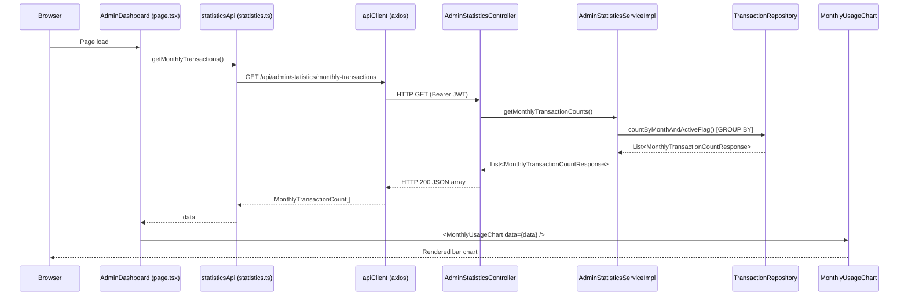
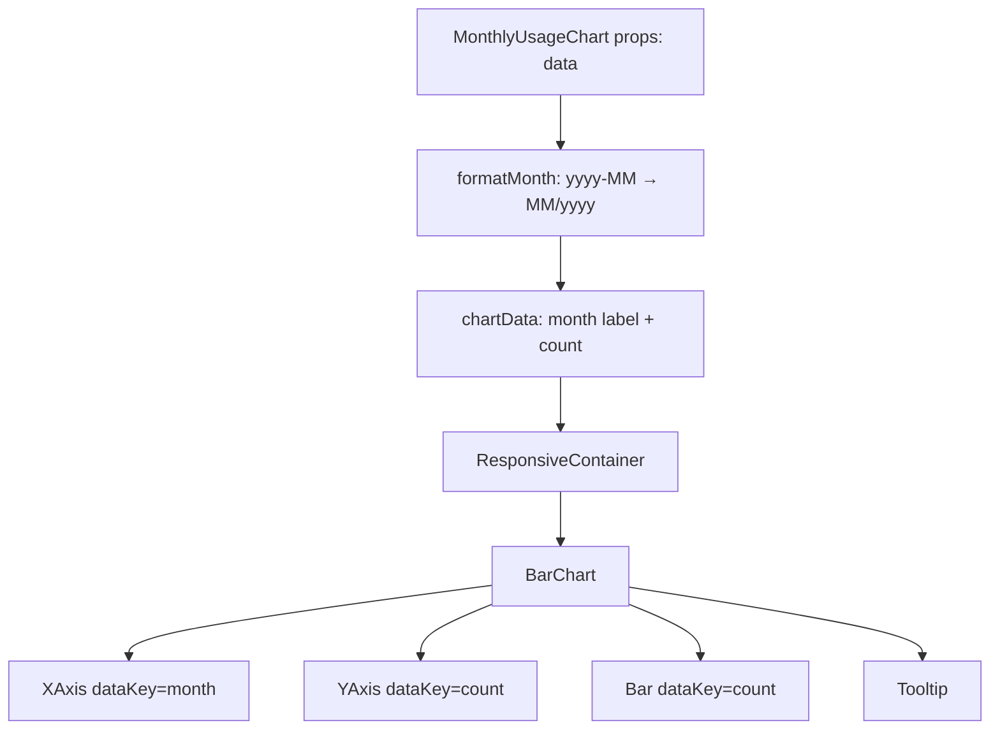

# Design Document: Admin Monthly Usage Chart

## Overview

This feature adds a bar chart to the Admin Dashboard (`/admin/dashboard`) that visualizes the number of transactions created on the system per month. The chart gives admins a quick visual overview of platform usage trends over time.

The implementation spans both layers of the stack:

- **Backend (Spring Boot)**: A new admin-only endpoint `GET /api/admin/statistics/monthly-transactions` backed by a single GROUP BY aggregation query. A new `AdminStatisticsController` and `AdminStatisticsService` are introduced to keep admin-scoped statistics separate from the existing per-user `StatisticsController`.
- **Frontend (Next.js + TypeScript)**: A new `MonthlyUsageChart.tsx` component renders the data using `recharts`. The existing Admin Dashboard page is updated to fetch real data from the API and render the chart inside a `Card` container, with proper loading, error, and empty states.

---

## Architecture



### Layer Responsibilities

| Layer | Responsibility |
|---|---|
| `AdminStatisticsController` | Route `/api/admin/statistics/monthly-transactions`, enforce `ADMIN` role via `@PreAuthorize` |
| `AdminStatisticsService` | Business logic interface for admin statistics |
| `AdminStatisticsServiceImpl` | Delegates to repository, maps projection to response DTO |
| `TransactionRepository` | New JPQL GROUP BY query returning `(yearMonth, count)` projections |
| `MonthlyTransactionCountResponse` | Backend DTO: `{ month: String, count: long }` |
| `statisticsApi.getMonthlyTransactions` | Frontend API function calling the endpoint via `apiClient` |
| `MonthlyTransactionCount` | Frontend type: `{ month: string, count: number }` |
| `MonthlyUsageChart` | Presentational React component rendering the recharts bar chart |
| `AdminDashboard` (page.tsx) | Orchestrates data fetching, state management, and renders the chart |

---

## Components and Interfaces

### Backend

#### `AdminStatisticsController`

New controller at `/api/admin/statistics`. Separate from the existing `StatisticsController` (which handles per-user stats) to maintain clear separation of concerns.

```java
@RestController
@RequestMapping("/api/admin/statistics")
@RequiredArgsConstructor
public class AdminStatisticsController {

    private final AdminStatisticsService adminStatisticsService;

    @GetMapping("/monthly-transactions")
    @PreAuthorize("hasRole('ADMIN')")
    public ResponseEntity<List<MonthlyTransactionCountResponse>> getMonthlyTransactions() {
        return ResponseEntity.ok(adminStatisticsService.getMonthlyTransactionCounts());
    }
}
```

#### `AdminStatisticsService` (interface)

```java
public interface AdminStatisticsService {
    List<MonthlyTransactionCountResponse> getMonthlyTransactionCounts();
}
```

#### `AdminStatisticsServiceImpl`

Fetches the projection list from the repository and maps it to the response DTO. The sort order is enforced at the query level (ORDER BY in JPQL).

#### `MonthlyTransactionCountResponse` (DTO)

```java
@Builder
@Getter
@AllArgsConstructor
public class MonthlyTransactionCountResponse {
    private String month;  // format: "yyyy-MM", e.g. "2026-01"
    private long count;
}
```

#### `MonthlyTransactionCountProjection` (interface projection)

```java
public interface MonthlyTransactionCountProjection {
    String getYearMonth();  // "yyyy-MM" formatted string
    long getCount();
}
```

#### New query in `TransactionRepository`

```java
@Query("""
    SELECT FUNCTION('DATE_FORMAT', t.date, '%Y-%m') AS yearMonth,
           COUNT(t) AS count
    FROM Transaction t
    WHERE t.deleteFlag = :deleteFlag
    GROUP BY FUNCTION('DATE_FORMAT', t.date, '%Y-%m')
    ORDER BY yearMonth ASC
    """)
List<MonthlyTransactionCountProjection> countActiveTransactionsByMonth(
    @Param("deleteFlag") DeleteFlag deleteFlag
);
```

> **Design decision**: Using `DATE_FORMAT` (MySQL-specific) rather than JPQL `YEAR()`/`MONTH()` functions to produce the `yyyy-MM` string directly in the query, avoiding in-memory string formatting. This is acceptable given the project already targets MySQL (see `pom.xml` and `docker-compose.yml`). The `deleteFlag` parameter is passed explicitly rather than hardcoded to keep the query testable with H2 in unit tests — though `DATE_FORMAT` is MySQL-specific, so integration tests will use MySQL.

#### Security

The endpoint is secured via `@PreAuthorize("hasRole('ADMIN')")` (method-level security, already enabled via `@EnableMethodSecurity` in `SecurityConfig`). The existing JWT filter handles 401 for missing/invalid tokens. Spring Security returns 403 for authenticated non-admin users.

The `/api/admin/**` path pattern does not need to be added to `SecurityConfig.filterChain` because `@PreAuthorize` handles it at the method level, consistent with how the project already secures category mutation endpoints.

---

### Frontend

#### `MonthlyTransactionCount` type (added to `lib/types/api.ts`)

```typescript
export interface MonthlyTransactionCount {
  month: string;  // "yyyy-MM", e.g. "2026-01"
  count: number;
}
```

#### `getMonthlyTransactions` function (added to `lib/api/statistics.ts`)

```typescript
getMonthlyTransactions: () =>
  apiClient
    .get<MonthlyTransactionCount[]>('/api/admin/statistics/monthly-transactions')
    .then((r) => r.data),
```

#### `MonthlyUsageChart` component

File: `MoneyTrack_FE/app/admin/dashboard/MonthlyUsageChart.tsx`

Props:
```typescript
interface MonthlyUsageChartProps {
  data: MonthlyTransactionCount[];
}
```

The component:
- Transforms `month` from `yyyy-MM` to `MM/yyyy` for X-axis display using a pure `formatMonth` helper function.
- Uses `ResponsiveContainer`, `BarChart`, `Bar`, `XAxis`, `YAxis`, `CartesianGrid`, `Tooltip` from `recharts`.
- Is purely presentational — no data fetching, no state.



#### Admin Dashboard page updates

The `page.tsx` is converted from a static mock-data page to a data-fetching page using `useState` + `useEffect`. Three UI states are managed:

| State | UI |
|---|---|
| `loading = true` | Spinner / skeleton in chart area |
| `error !== null` | Error message in chart area |
| `data.length === 0` | Empty state message in chart area |
| `data.length > 0` | `<MonthlyUsageChart data={data} />` |

The chart is rendered inside a `Card` component (consistent with existing stats cards) below the stats cards grid.

---

## Data Models

### Backend DTO

```
MonthlyTransactionCountResponse
├── month: String       // "yyyy-MM" (e.g. "2026-01")
└── count: long         // non-negative integer
```

### Frontend Type

```
MonthlyTransactionCount
├── month: string       // "yyyy-MM" (e.g. "2026-01")
└── count: number       // non-negative integer
```

### API Contract

**Request:**
```
GET /api/admin/statistics/monthly-transactions
Authorization: Bearer <jwt>
```

**Response (200 OK):**
```json
[
  { "month": "2025-11", "count": 42 },
  { "month": "2025-12", "count": 67 },
  { "month": "2026-01", "count": 31 }
]
```

**Response (empty database):**
```json
[]
```

**Error responses:**
- `401 Unauthorized` — missing or invalid JWT
- `403 Forbidden` — authenticated user lacks `ADMIN` role

---

## Correctness Properties

*A property is a characteristic or behavior that should hold true across all valid executions of a system — essentially, a formal statement about what the system should do. Properties serve as the bridge between human-readable specifications and machine-verifiable correctness guarantees.*

### Property 1: Month Format Invariant

*For any* set of transactions in the database, every `month` field in the returned `MonthlyTransactionCountResponse` list SHALL match the format `yyyy-MM` (i.e., a 4-digit year, a hyphen, and a 2-digit zero-padded month).

**Validates: Requirements 1.2, 2.2**

---

### Property 2: Ascending Sort Order Invariant

*For any* set of transactions spanning any combination of months and years, the returned list SHALL be sorted in strictly ascending chronological order by `month` — meaning for any two consecutive elements `a` and `b` in the list, `a.month` is lexicographically less than `b.month` (which is equivalent to chronological order for `yyyy-MM` strings).

**Validates: Requirements 1.3**

---

### Property 3: Active-Only Count Invariant

*For any* set of transactions containing a mix of `ACTIVE` and non-`ACTIVE` (deleted) records, the `count` for each month in the returned list SHALL equal exactly the number of `ACTIVE` transactions in that month — deleted transactions SHALL NOT be included in any count.

**Validates: Requirements 1.5, 2.3**

---

### Property 4: Frontend Month Display Format Transformation

*For any* valid `month` string in `yyyy-MM` format, the `formatMonth` helper function in `MonthlyUsageChart` SHALL produce a string in `MM/yyyy` format — specifically, the two-digit month appears first, followed by a slash, followed by the four-digit year, with no change to the underlying numeric values.

**Validates: Requirements 3.3**

---

## Error Handling

### Backend

| Scenario | Behavior |
|---|---|
| No transactions in DB | Repository returns empty list → service returns `[]` → controller returns `HTTP 200 []` |
| Unauthenticated request (no/invalid JWT) | `JwtAuthFilter` rejects → `HTTP 401` |
| Authenticated non-admin user | `@PreAuthorize` rejects → `HTTP 403` |
| Database error | Spring's default exception handling → `HTTP 500` (no special handling needed for this feature) |

### Frontend

| Scenario | UI Behavior |
|---|---|
| API call in progress | Loading spinner/skeleton shown in chart card area |
| API returns error (4xx/5xx) | User-friendly error message shown in chart card area (e.g., "Không thể tải dữ liệu biểu đồ") |
| API returns `[]` | Empty state message shown (e.g., "Chưa có dữ liệu giao dịch") |
| API returns valid data | `MonthlyUsageChart` rendered with data |

The existing `apiClient` interceptor already handles `401` globally by redirecting to `/login`, so the dashboard does not need to handle that case explicitly.

---

## Testing Strategy

### Backend Unit Tests (JUnit 5 + Mockito, H2 in-memory)

**`AdminStatisticsServiceImplTest`**
- Verify `getMonthlyTransactionCounts()` returns an empty list when no transactions exist (edge case for Requirement 1.4).
- Verify the service correctly maps repository projections to `MonthlyTransactionCountResponse` DTOs.

**`TransactionRepositoryTest`** (Spring Data JPA slice test with H2)
- Property 1: Insert transactions across random months, verify all returned `yearMonth` values match `^\d{4}-\d{2}$`.
- Property 2: Insert transactions in non-chronological order, verify returned list is sorted ascending by `yearMonth`.
- Property 3: Insert a mix of `ACTIVE` and `DELETED` transactions, verify counts match only `ACTIVE` records per month.

> Note: `DATE_FORMAT` is MySQL-specific and not supported by H2. For repository slice tests, the JPQL query will use `YEAR(t.date)` and `MONTH(t.date)` with in-memory string formatting in the service layer as an alternative for the H2 test profile, or the tests will use `@DataJpaTest` with a MySQL Testcontainer. The design prefers Testcontainers for accuracy.

**`AdminStatisticsControllerTest`** (MockMvc + `@WebMvcTest`)
- Verify `HTTP 200` with valid admin JWT (example test for Requirement 1.1).
- Verify `HTTP 403` with a USER-role JWT (example test for Requirement 1.6).
- Verify `HTTP 401` with no JWT (example test for Requirement 1.7).

### Frontend Unit Tests

Since the frontend uses Next.js with TypeScript and no test framework is currently configured in `package.json`, tests for the pure `formatMonth` helper function (Property 4) can be added using **Vitest** (the standard choice for Vite/Next.js projects).

**`formatMonth.test.ts`**
- Property 4: Use `@fast-check/vitest` to generate random valid `yyyy-MM` strings and verify `formatMonth` always produces the corresponding `MM/yyyy` string with correct value transposition.

**Property Test Configuration:**
- Minimum 100 iterations per property test.
- Tag format: `// Feature: admin-monthly-usage-chart, Property {N}: {property_text}`

### Integration / Smoke Tests

- Verify the endpoint is accessible with a real admin JWT against a running backend (manual or CI smoke test).
- Verify `MonthlyUsageChart.tsx` file exists at the specified path (structural check).
- Verify `ResponsiveContainer` is used in the component (responsive layout check for Requirement 3.6).
