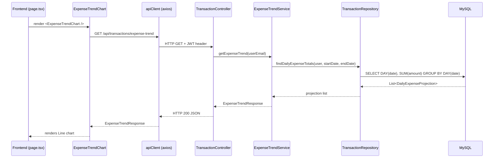

# Design Document: Expense Trend Chart

## Overview

Tính năng này bổ sung một biểu đồ đường (line chart) vào trang chủ của người dùng, hiển thị tổng chi tiêu (EXPENSE) theo từng ngày trong tháng, so sánh tháng hiện tại với tháng trước. Hệ thống gồm hai phần:

- **Backend**: Thêm endpoint `GET /api/transactions/expense-trend` vào `TransactionController`, với service method mới trong `StatisticsService` (hoặc một service riêng) và một JPQL aggregation query trong `TransactionRepository`.
- **Frontend**: Component `ExpenseTrendChart.tsx` độc lập sử dụng `chart.js` + `react-chartjs-2`, được tích hợp vào trang chủ `app/(main)/page.tsx`.

Thiết kế tận dụng tối đa các pattern đã có: `apiClient` axios, `useFetch` hook, `ChartCard` wrapper, và cấu trúc `lib/api` + `lib/types`.

---

## Architecture



### Các lớp liên quan

```
Backend
├── controller/TransactionController.java       ← thêm endpoint /expense-trend
├── service/ExpenseTrendService.java            ← interface mới
├── service/impl/ExpenseTrendServiceImpl.java   ← logic tổng hợp dữ liệu
├── repository/TransactionRepository.java       ← thêm JPQL aggregation query
└── dto/response/ExpenseTrendResponse.java      ← DTO mới

Frontend
├── lib/types/api.ts                            ← thêm ExpenseTrendResponse type
├── lib/api/transactions.ts                     ← thêm getExpenseTrend()
├── components/ExpenseTrendChart.tsx            ← component mới
└── app/(main)/page.tsx                         ← tích hợp component
```

---

## Components and Interfaces

### Backend

#### `ExpenseTrendResponse` (DTO)

```java
@Getter
@Builder
public class ExpenseTrendResponse {
    private List<BigDecimal> currentMonth;   // index 0 = ngày 1, index N-1 = ngày cuối tháng
    private List<BigDecimal> previousMonth;
}
```

#### `DailyExpenseProjection` (JPA Projection)

```java
public interface DailyExpenseProjection {
    int getDayOfMonth();       // 1..31
    BigDecimal getTotalAmount();
}
```

#### `ExpenseTrendService` (interface)

```java
public interface ExpenseTrendService {
    ExpenseTrendResponse getExpenseTrend(String userEmail);
}
```

#### `ExpenseTrendServiceImpl`

- Lấy `User` từ `userEmail`.
- Xác định `currentYearMonth = YearMonth.now()` và `previousYearMonth = currentYearMonth.minusMonths(1)`.
- Gọi repository để lấy danh sách `DailyExpenseProjection` cho từng tháng.
- Khởi tạo mảng `BigDecimal[]` với kích thước bằng số ngày trong tháng, điền `BigDecimal.ZERO`.
- Map từng projection vào đúng index `dayOfMonth - 1`.
- Trả về `ExpenseTrendResponse`.

#### `TransactionRepository` — query mới

```java
@Query("""
    SELECT FUNCTION('DAY', t.date) AS dayOfMonth,
           COALESCE(SUM(t.amount), 0) AS totalAmount
    FROM Transaction t
    WHERE t.user = :user
      AND t.deleteFlag = :deleteFlag
      AND t.type = :type
      AND t.date >= :startDate
      AND t.date <= :endDate
    GROUP BY FUNCTION('DAY', t.date)
    ORDER BY dayOfMonth ASC
    """)
List<DailyExpenseProjection> findDailyExpenseTotals(
    @Param("user") User user,
    @Param("deleteFlag") DeleteFlag deleteFlag,
    @Param("type") TransactionType type,
    @Param("startDate") LocalDate startDate,
    @Param("endDate") LocalDate endDate
);
```

#### `TransactionController` — endpoint mới

```java
@GetMapping("/expense-trend")
public ResponseEntity<ExpenseTrendResponse> getExpenseTrend(
        @AuthenticationPrincipal UserDetails userDetails) {
    return ResponseEntity.ok(
        expenseTrendService.getExpenseTrend(userDetails.getUsername())
    );
}
```

---

### Frontend

#### `ExpenseTrendResponse` type (thêm vào `lib/types/api.ts`)

```typescript
export interface ExpenseTrendResponse {
  currentMonth: number[];   // length = số ngày trong tháng hiện tại
  previousMonth: number[];  // length = số ngày trong tháng trước
}
```

#### `getExpenseTrend` (thêm vào `lib/api/transactions.ts`)

```typescript
getExpenseTrend: () =>
  apiClient
    .get<ExpenseTrendResponse>('/api/transactions/expense-trend')
    .then((r) => r.data),
```

#### `ExpenseTrendChart` component

Props: không có (tự fetch dữ liệu bên trong).

Sử dụng `useFetch` hook để gọi `transactionsApi.getExpenseTrend()`.

States:
- `loading` → hiển thị spinner
- `error` → hiển thị thông báo lỗi
- `data` → render `<Line>` chart

Chart config:
- `type`: Line
- `tension`: 0.4 (cubic interpolation)
- Dataset "Tháng này": `borderColor: '#ef4444'`, `backgroundColor: 'rgba(239,68,68,0.1)'`
- Dataset "Tháng trước": `borderColor: '#94a3b8'`, `backgroundColor: 'rgba(148,163,184,0.1)'`
- X-axis labels: `[1, 2, ..., N]` (N = `currentMonth.length`)
- `responsive: true`, `maintainAspectRatio: false`
- Tooltip: hiển thị ngày + số tiền định dạng VND

#### Tích hợp vào `app/(main)/page.tsx`

Thêm `<ChartCard title="Xu hướng chi tiêu">` bên dưới section pie chart hiện tại, chứa `<ExpenseTrendChart />`.

---

## Data Models

### `ExpenseTrendResponse` JSON

```json
{
  "currentMonth":  [0, 150000, 0, 320000, 0, 0, 75000, ...],  // 28-31 phần tử
  "previousMonth": [0, 0, 200000, 0, 450000, 0, 0, ...]        // 28-31 phần tử
}
```

- Mỗi phần tử là tổng `amount` của các giao dịch `EXPENSE + ACTIVE` trong ngày tương ứng.
- Index `i` tương ứng với ngày `i+1` của tháng.
- Ngày không có giao dịch → giá trị `0`.

### Luồng dữ liệu

```
Transaction (DB)
  → JPQL GROUP BY DAY → DailyExpenseProjection[]
  → fill zero array   → BigDecimal[] (length = days in month)
  → ExpenseTrendResponse { currentMonth, previousMonth }
  → JSON              → number[] (frontend)
  → Chart.js datasets → Line chart
```

---

## Correctness Properties

*A property is a characteristic or behavior that should hold true across all valid executions of a system — essentially, a formal statement about what the system should do. Properties serve as the bridge between human-readable specifications and machine-verifiable correctness guarantees.*

### Property 1: Array length equals days in month

*For any* current date, the `currentMonth` array returned by `ExpenseTrendService.getExpenseTrend()` SHALL have length equal to the number of days in the current calendar month, and the `previousMonth` array SHALL have length equal to the number of days in the previous calendar month.

**Validates: Requirements 1.2, 1.3, 2.2**

---

### Property 2: Daily totals correctly aggregate EXPENSE transactions

*For any* set of EXPENSE+ACTIVE transactions belonging to a user within a month, the service SHALL produce a result array where each index `i` contains the exact sum of `amount` values for all transactions on day `i+1`, and all other indices contain `0`.

**Validates: Requirements 1.4, 2.1, 2.3**

---

### Property 3: Non-EXPENSE and non-ACTIVE transactions are excluded

*For any* transaction set containing INCOME, DEBT, or DELETED transactions mixed with EXPENSE+ACTIVE transactions, the daily totals SHALL be identical to the totals computed from the EXPENSE+ACTIVE subset alone — i.e., non-qualifying transactions contribute `0` to every day's total.

**Validates: Requirements 1.5**

---

### Property 4: User data isolation

*For any* two distinct users each having their own EXPENSE transactions in the same month, the `getExpenseTrend` result for each user SHALL reflect only that user's own transactions and SHALL NOT be influenced by the other user's data.

**Validates: Requirements 1.6**

---

### Property 5: X-axis labels match array length

*For any* `ExpenseTrendResponse` with `currentMonth` of length N, the X-axis labels generated by `ExpenseTrendChart` SHALL be exactly `[1, 2, ..., N]`.

**Validates: Requirements 3.4**

---

## Error Handling

### Backend

| Tình huống | Xử lý |
|---|---|
| JWT không hợp lệ / thiếu | Spring Security trả về `401 Unauthorized` (đã có sẵn) |
| User không tồn tại | `ResourceNotFoundException` → `GlobalExceptionHandler` trả về `404` |
| Lỗi database | Exception lan lên `GlobalExceptionHandler` → `500 Internal Server Error` |

### Frontend

| Tình huống | Xử lý |
|---|---|
| Đang fetch | Hiển thị spinner (`animate-spin`) thay cho chart |
| API trả về lỗi | `useFetch` bắt lỗi, set `error` state → hiển thị thông báo lỗi tiếng Việt |
| Dữ liệu toàn số 0 | Chart vẫn render với đường phẳng tại y=0 (không hiển thị empty state) |
| Token hết hạn (401) | `apiClient` interceptor tự redirect về `/login` (đã có sẵn) |

---

## Testing Strategy

### Backend — Unit Tests (JUnit 5 + Mockito)

- **`ExpenseTrendServiceImplTest`**:
  - Verify array length = days in month cho tháng 28/29/30/31 ngày (inject clock cố định).
  - Verify tổng hợp đúng khi có nhiều giao dịch cùng ngày.
  - Verify ngày không có giao dịch → `BigDecimal.ZERO`.
  - Verify chỉ tính `EXPENSE + ACTIVE`, bỏ qua `INCOME`, `DEBT`, `DELETED`.
  - Verify user isolation: mock repository trả về đúng data theo user.

- **`TransactionControllerTest`** (MockMvc):
  - `GET /api/transactions/expense-trend` không có token → `401`.
  - `GET /api/transactions/expense-trend` có token hợp lệ → `200` + JSON shape đúng.

### Backend — Property-Based Tests (JUnit 5 + jqwik)

Sử dụng thư viện **jqwik** (property-based testing cho Java/JUnit 5).

Mỗi property test chạy tối thiểu **100 lần** với dữ liệu sinh ngẫu nhiên.

**Property 1 — Array length equals days in month**
```
// Feature: expense-trend-chart, Property 1: array length equals days in month
@Property
void arrayLengthEqualsMonthDays(@ForAll("yearMonths") YearMonth ym) {
    // inject clock cố định tại ym
    // gọi service với mock repository trả về []
    // assert currentMonth.size() == ym.lengthOfMonth()
    // assert previousMonth.size() == ym.minusMonths(1).lengthOfMonth()
}
```

**Property 2 — Daily totals correctly aggregate**
```
// Feature: expense-trend-chart, Property 2: daily totals correctly aggregate EXPENSE transactions
@Property
void dailyTotalsAreCorrect(@ForAll List<@From("expenseTransactions") Transaction> txns) {
    // mock repository trả về txns
    // gọi service
    // assert result[day-1] == sum of txns on that day
}
```

**Property 3 — Non-EXPENSE/non-ACTIVE excluded**
```
// Feature: expense-trend-chart, Property 3: non-EXPENSE and non-ACTIVE transactions are excluded
@Property
void nonExpenseTransactionsExcluded(@ForAll List<@From("mixedTransactions") Transaction> txns) {
    // mock repository chỉ trả về EXPENSE+ACTIVE subset
    // assert result identical to result with only EXPENSE+ACTIVE
}
```

**Property 4 — User data isolation**
```
// Feature: expense-trend-chart, Property 4: user data isolation
@Property
void userDataIsIsolated(@ForAll("users") User userA, @ForAll("users") User userB) {
    // mock repository: userA có txns, userB có txns khác
    // assert getExpenseTrend(userA) không chứa data của userB
}
```

### Frontend — Unit Tests (Vitest + fast-check)

Dự án đã có **vitest** và **fast-check** trong `devDependencies`.

**Property 5 — X-axis labels match array length**
```typescript
// Feature: expense-trend-chart, Property 5: X-axis labels match array length
it('x-axis labels match currentMonth length', () => {
  fc.assert(
    fc.property(
      fc.array(fc.float({ min: 0 }), { minLength: 28, maxLength: 31 }),
      fc.array(fc.float({ min: 0 }), { minLength: 28, maxLength: 31 }),
      (currentMonth, previousMonth) => {
        const labels = buildChartLabels(currentMonth);
        expect(labels).toEqual(
          Array.from({ length: currentMonth.length }, (_, i) => i + 1)
        );
      }
    ),
    { numRuns: 100 }
  );
});
```

**Example-based tests (Vitest)**:
- Render `<ExpenseTrendChart />` với mock `useFetch` → loading state hiển thị spinner.
- Render với mock error → hiển thị thông báo lỗi.
- Render với all-zero data → chart vẫn render (không empty state).
- Chart config có `tension: 0.4`, dataset labels đúng ("Tháng này", "Tháng trước"), colors đúng.
- `getExpenseTrend` gọi đúng endpoint `/api/transactions/expense-trend`.
